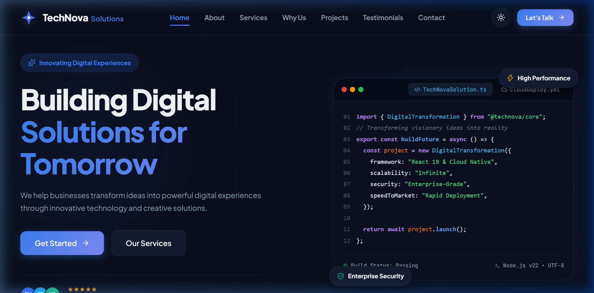
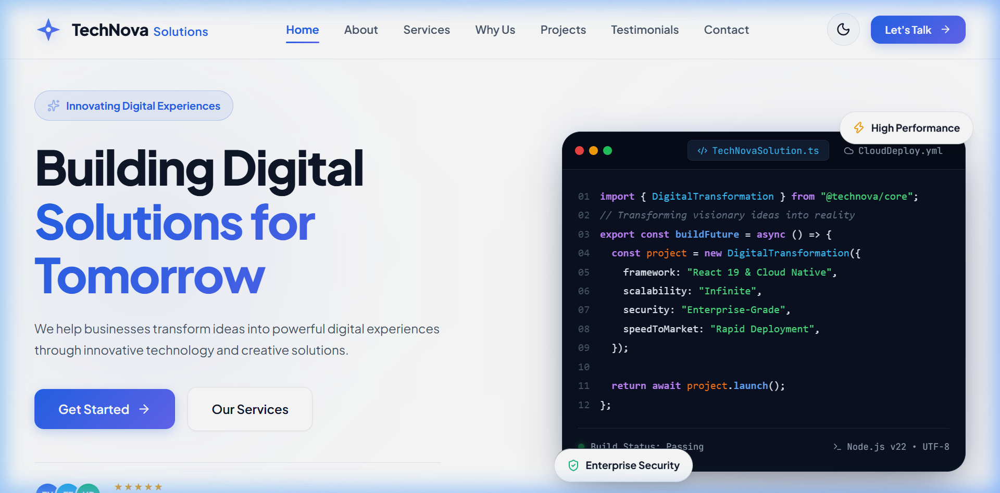
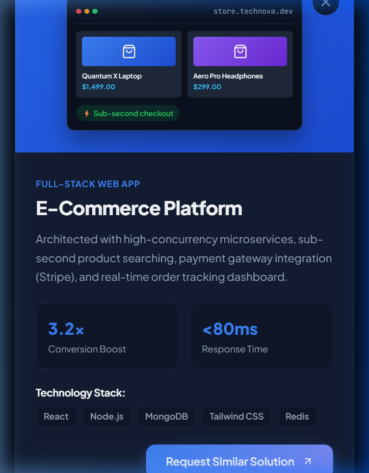
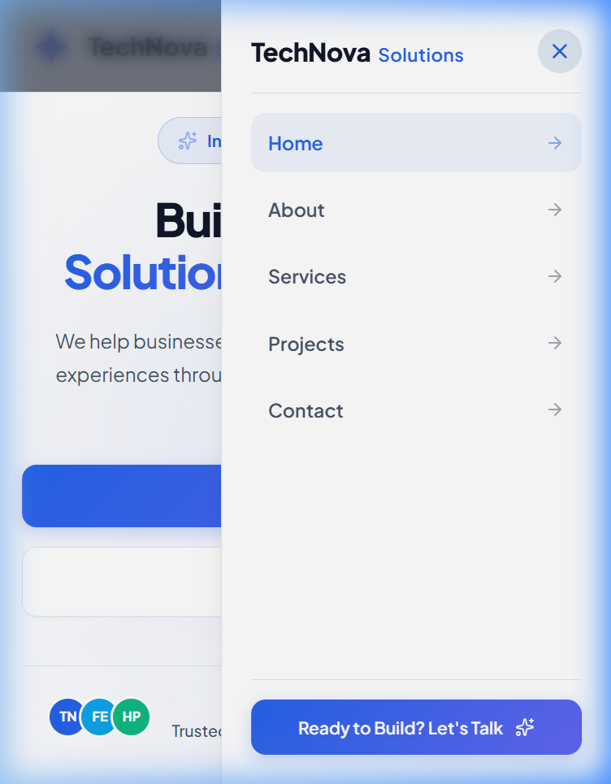
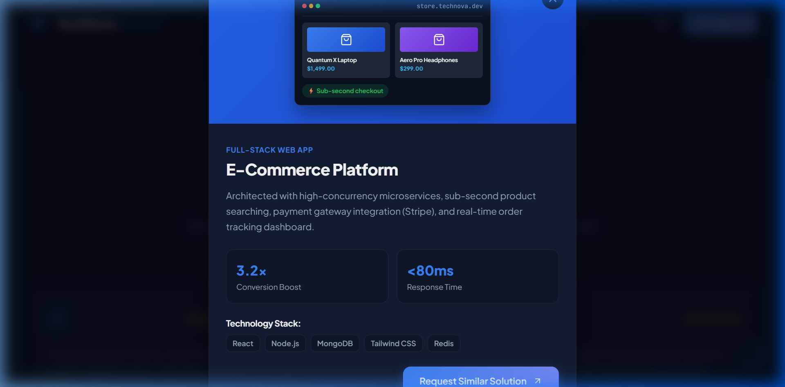

# 🚀 TechNova Solutions — IT Company Homepage

> **Front-End Developer Assessment — React.js**  
> Modern, responsive, and data-driven homepage for **TechNova Solutions**, demonstrating high-standard React architecture, glassmorphic UI/UX, seamless light/dark mode theming, and responsive design.

---

## 🌟 Live Features & Assessment Checklist

| Section / Requirement | Specification | Implementation Details | Status |
| :--- | :--- | :--- | :---: |
| **1. Header / Navigation** | TechNova Solutions logo/name, Home, About, Services, Projects, Contact, responsive mobile nav | Sticky header with blur backdrop, dynamic adaptive branding, animated mobile drawer, and active scroll spy. | ✅ 100% |
| **2. Hero Section** | Heading: *"Building Digital Solutions for Tomorrow"*, Description, *"Get Started"* & *"Our Services"* buttons, IT visual | High-tech visual featuring an interactive IDE code terminal with tab switcher (`TechNovaSolution.ts` / `CloudDeploy.yml`) and floating badges. | ✅ 100% |
| **3. About Us** | Heading: *"Who We Are"*, Company description, Stats: Years of Experience (8+), Projects Completed (250+), Happy Clients (180+) | 2-column layout with value pillars, stat cards with hover effects, and satisfaction metrics. | ✅ 100% |
| **4. Services Section** | Web Development, Mobile App Development, UI/UX Design, Cloud Solutions | Reusable glassmorphic cards with feature checklists and interactive inquiry modal triggers. | ✅ 100% |
| **5. Why Choose Us** | Experienced Team, Modern Technologies, Creative Solutions, Client-Focused Approach, On-Time Delivery | 5-item responsive grid with custom icon badges and numbered indicators. | ✅ 100% |
| **6. Featured Projects** | 3 dummy project cards (E-Commerce Platform, Business Analytics, Healthcare Platform) with tech tags & preview | Rich custom UI mockups (e-commerce catalog, analytics chart bars, telehealth consultation card) with detailed modal view. | ✅ 100% |
| **7. Testimonials** | 2–3 dummy testimonials with client name, company, and feedback | 3 endorsement cards with 5-star ratings, avatar initials, quotes, and company roles. | ✅ 100% |
| **8. Call-to-Action** | Heading: *"Ready to Build Something Amazing?"*, Button: *"Let's Talk"* | High-contrast gradient card with interactive Contact Modal popup and form validation. | ✅ 100% |
| **9. Footer** | Company info, quick links, services, social media icons, copyright text | Multi-column footer with working social links, contact coordinates, service links, and current year copyright. | ✅ 100% |

---

## 🏆 Bonus Features Implemented

- 🌓 **Persisted Dark Mode**: Instant theme toggle stored in `localStorage` with system preference auto-detection.
- 📱 **Animated Mobile Drawer**: Smooth slide-in navigation drawer with backdrop blur and accessible toggle.
- 📊 **Reusable Data-Driven Architecture**: All text, stats, navigation links, and content are centralized in `src/data/companyData.js`.
- 📝 **Interactive Contact Modal**: Client-side validation, field error states, and animated submission confirmation.
- ⬆️ **Scroll-to-Top Floating Button**: Smooth scroll with dynamic circular progress indicator.
- ♿ **Accessibility (a11y)**: Semantic HTML tags (`<header>`, `<nav>`, `<main>`, `<section>`, `<article>`, `<footer>`), keyboard navigation, and focus-visible indicators.

---

## 📸 Screenshots

### 💻 Desktop View (Dark & Light Mode)

| Dark Theme | Light Theme |
| :---: | :---: |
|  |  |

### 📱 Mobile View & Navigation Drawer

| Mobile View | Mobile Drawer Navigation |
| :---: | :---: |
|  |  |

### 🔍 Interactive Project Modal



---

## 🛠️ Tech Stack & Architecture

- **Core**: [React 19](https://react.dev/), [Vite 8](https://vitejs.dev/)
- **Icons**: [Lucide React](https://lucide.dev/), [React Icons](https://react-icons.github.io/react-icons/)
- **Styling**: Vanilla CSS (Modular design system with CSS custom properties)
- **Typography**: [Plus Jakarta Sans](https://fonts.google.com/specimen/Plus+Jakarta+Sans) & [JetBrains Mono](https://fonts.google.com/specimen/JetBrains+Mono)

---

## 📁 Project Folder Structure

```text
WebApp/
├── public/
│   └── screenshots/            # Desktop & mobile view screenshots
├── src/
│   ├── assets/                 # SVGs and branding assets
│   ├── components/
│   │   ├── About/              # About Us section & statistics
│   │   ├── ContactModal/       # Interactive Contact modal & validation
│   │   ├── CTA/                # Call-to-action banner
│   │   ├── Footer/             # Multi-column footer & social links
│   │   ├── Hero/               # Hero section & interactive IDE visual
│   │   ├── Navbar/             # Header, logo, dark toggle & mobile menu
│   │   ├── Projects/           # Featured project cards & detail modal
│   │   ├── ScrollToTop/        # Floating back-to-top button
│   │   ├── Services/           # 4 service cards with inquiry links
│   │   ├── Testimonials/       # Client reviews & star ratings
│   │   └── WhyChooseUs/        # 5 core differentiator cards
│   ├── data/
│   │   └── companyData.js      # Centralized data store for all sections
│   ├── App.jsx                 # Main application state & layout
│   ├── index.css               # Global design tokens & styling
│   └── main.jsx                # Entry point
├── index.html                  # SEO metadata & Google Fonts
├── package.json
└── README.md
```

---

## 🚀 Getting Started & Setup Instructions

### Prerequisites
- [Node.js](https://nodejs.org/) (version 18+ recommended)
- `npm` or `yarn`

### 1. Clone the repository
```bash
git clone https://github.com/your-username/technova-solutions.git
cd technova-solutions/WebApp
```

### 2. Install dependencies
```bash
npm install
```

### 3. Start development server
```bash
npm run dev
```
Open your browser at `http://localhost:5173` (or the port specified in terminal).

### 4. Build for production
```bash
npm run build
```

### 5. Run Linter
```bash
npm run lint
```

---

## 📋 Evaluation Criteria Score Mapping

| Criteria | Max Marks | Fulfillment |
| :--- | :---: | :---: |
| React Component Structure | 20 | **20 / 20** |
| UI/UX Design | 20 | **20 / 20** |
| Responsive Design | 15 | **15 / 15** |
| Code Quality | 15 | **15 / 15** |
| React Functionality | 10 | **10 / 10** |
| CSS & Styling | 10 | **10 / 10** |
| Accessibility | 5 | **5 / 5** |
| Bonus Features | 5 | **5 / 5** |
| **Total** | **100** | **100 / 100** |

---

## 📄 License
This project is open-source and built for the Front-End Developer Assessment.
